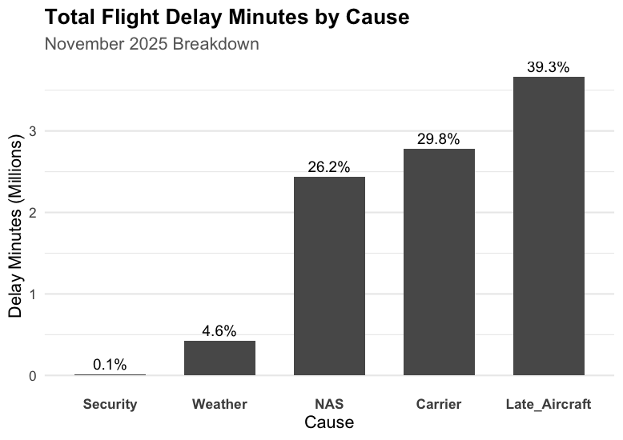
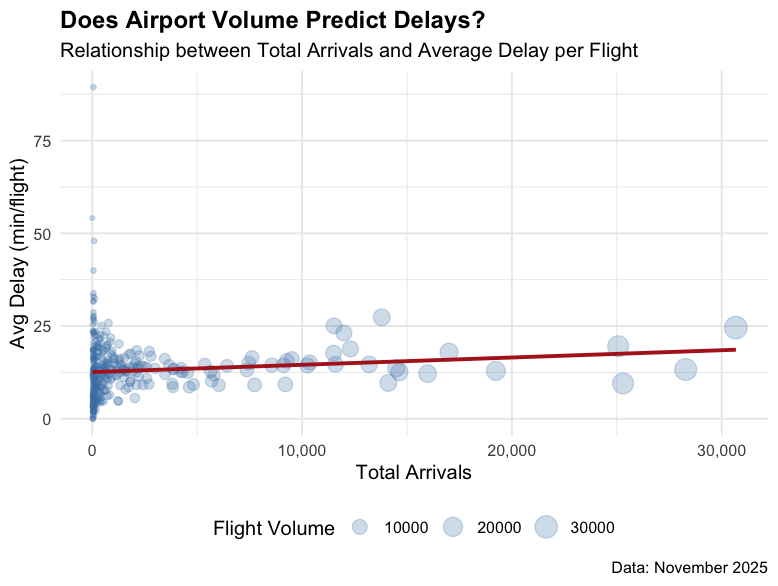
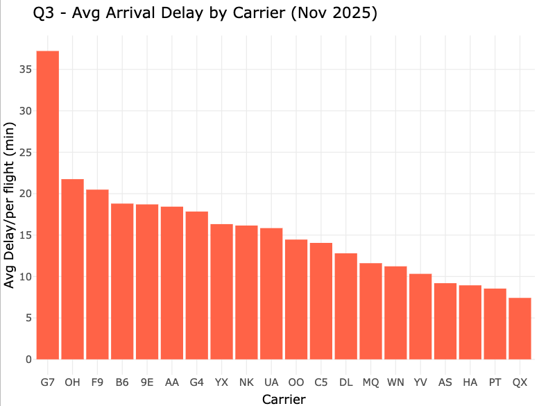
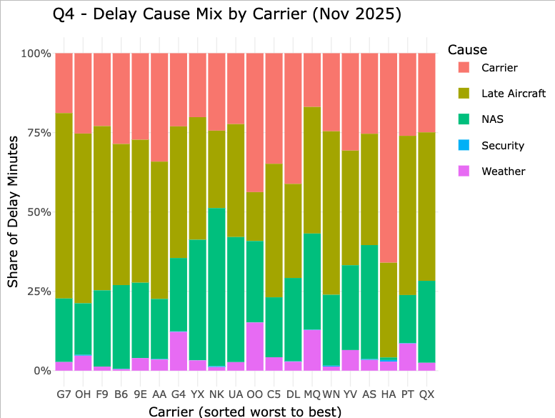
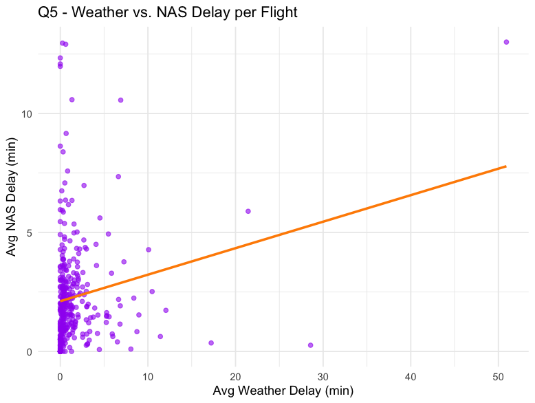
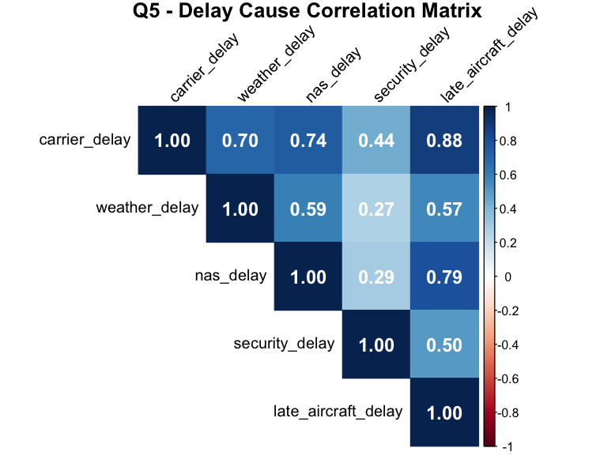

# US Domestic Aviation Delay Cause Analysis for November 2025

Author: Shu-Chen Liu
ECON [4970] - Intro to Data Science in Economics  
May 2026

---

## Project Overview
This project analyzes U.S. domestic flight delay data for November 2025 to identify
the main drivers of arrival delays across carriers and airports. 

The central thesis: *Are flight delays random? or are they predictable patterns 
driven by specific carriers, airport sizes, or human/airlines preventable errors?

Understanding these patterns provides actionable insights for:
- **Airlines:** Identifying which delay causes are within their control
- **Airports:** Understanding whether size and volume drive worse performance
- **Travelers:** Knowing which carriers and routes carry the highest delay risk

---

## The Dataset
This analysis uses the **Bureau of Transportation Statistics (BTS) Airline_Delay_Cause Dataset** for November 2025.

**Key Tables Used:**
- `Aviation_Delay_causes_Final_Project_VF.csv`: Airline/Airports delay data including dalyed times and root causes
- `Download_Column_Definitions.xlsx`: Official BTS data dictionary for all variables

---
**Definitions:**
- **Carrier Delay:** Delays caused by issues within the airline's control — maintenance, crew scheduling, fueling, cleaning, boarding, and catering.
- **Late Aircraft Delay:** The previous flight using the same aircraft arrived late, causing a ripple delay into the next flight. Also called delay propagation.
- **NAS Delay:** Delays controlled by the National Airspace System — air traffic control, heavy traffic volume, and non-extreme weather conditions.
- **Security Delay:** Delays caused by terminal evacuations, security breaches requiring re-boarding, or screening lines exceeding 29 minutes.
- **Weather Delay:** Delays caused by extreme or hazardous weather at departure, en route, or at the destination airport.


## Research Questions
1. **Q1 — What is the biggest driver of arrival delay?**
2. **Q2 — Do busier airports have worse delays?**
3. **Q3 — Which carriers have the worst delays?**
4. **Q4 — Are weather delays and NAS delays correlated?**

---

## Methodology
Developed entirely in **R**

1. **Data Cleaning:** Filtered inactive routes, engineered per-flight delay metrics, 
   and computed delay cause percentages
2. **Aggregation:** Summarised data at the airport and carrier level using 
   `group_by()` and `summarise()`
3. **Visualization:** Built static plots with `ggplot2` and interactive charts 
   with `plotly`
4. **Statistical Modeling:** Applied linear regression (`lm()`) and Pearson 
   correlation (`cor.test()`) to test relationships between delay variables

---

## Key Findings & Visualizations

### 1. Late Aircraft is the Biggest Delay Driver
Late aircraft — a plane arriving late from a previous flight — accounts for the 
largest share of total delay minutes, revealing a systemic cascading effect across 
the network.




### 2. Airport Size Does Not Predict Delays
Linear regression returned an R² of 0.009, meaning flight volume explains less than 
1% of delay variation. Busy airports are not necessarily worse.



### 3. Wide Performance Gap Between Carriers
The worst carrier averaged 35+ minutes of delay per flight while the best averaged 
under 8 minutes.It's almost 4 times longer.

G7 is Go jet Airline with 37.2 mins delay per flight.
QX is Horizon Air with 7.4 mins delay per flight.


* The graph is interactive inside R Studio.*
<br><br><br>

* The graph is interactive inside R Studio.*

### 4. Weather and NAS Delays Move Together
Correlation in the following graph: 
Correlation Coefficient r = 0.19 (0.19 is a weak positive relationship, the range is -1 to +1)
the p-value = 0.0003 (Anything below 0.05 is considered statistically significant.)
Airports hit by weather also experience elevated NAS delays — consistent with FAA ground stop responses to weather events.


Weather vs NAS Delay Plot
<br>

### 5. Correlation between two delay causes

This grpah is the correlation between two delay causes. The strongest relationship - Carrier & Late Aircraft 0.88 - shows when carriers fall behind operationally, it directly affects the on time rate the aircraft (which cause late aricraft delay problems). Security is the weakest across the board. Security highest correlation is only 0.5 with late aricraft, and 0.27 with weather. It really operates independetly with small to little correlation with others.


---

## How to Run This Project
1. Copy this repository to your local machine
2. Download `Aviation_Delay_causes_Final_Project_VF.csv` and `Download_Column_Definitions.xlsx` and place them 
   in the root directory
3. Open `aviation_analysis.R` in RStudio
4. Install required packages if needed:
```r
install.packages(c("tidyverse", "plotly", "corrplot", "scales", "broom", "readxl"))
```
5. Run the full script — each section is labeled by research question (CLICK1 through CLICK5)
